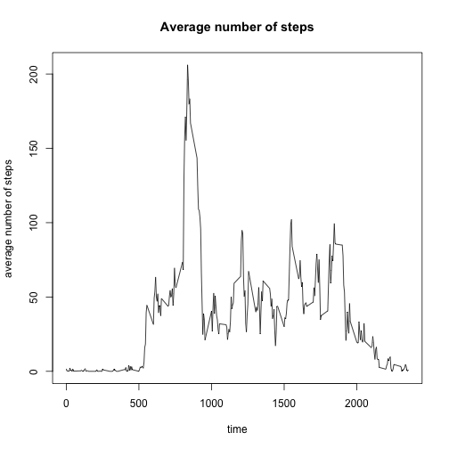

#My assignment


###Reading in data

```r
activity <- read.csv("activity.csv")
head(activity)
```

```
##   steps       date interval
## 1    NA 2012-10-01        0
## 2    NA 2012-10-01        5
## 3    NA 2012-10-01       10
## 4    NA 2012-10-01       15
## 5    NA 2012-10-01       20
## 6    NA 2012-10-01       25
```

###Total steps per day

```r
sumnarm <- function(x) {sum(x,na.rm = TRUE)}
tstep <- tapply(activity$steps,as.factor(activity$date),sumnarm)
hist(tstep, xlab = "Total steps per day", main = "Total steps per day")
```


```r
meantstep <- mean(tstep)
mediantstep <- median(tstep)
```
The mean of the total number of steps taken per day is 9354.2295082, and the median is 10395.  

###Average daily activity pattern

```r
meannarm <- function(x) {mean(x,na.rm = TRUE)}
mstep <- tapply(activity$steps,as.factor(activity$interval),meannarm)
plot(names(mstep),mstep,type = "l",xlab = "time", 
     ylab = "average number of steps", main = "Average number of steps")
```



```r
maxitv <- which.max(mstep)
```
The 5-minute interval from 835 contains the maximum number of steps (104).

###Missing values

```r
#computing total number of NAs.
nanum <- sum(is.na(activity$steps))

#replacing NAs by the mean of the 5-minute interval.
napos <- is.na(activity$steps)
nactivity <- activity
nactivity$steps[napos==TRUE] <- mstep[as.character(activity$interval[napos==TRUE])]

#calculating total number of steps each day
ntstep <- tapply(nactivity$steps,nactivity$date,sum)

#making a histogram
hist(ntstep, xlab = "total number of steps", main = "Total number of steps")
```


```r
meanntstep <- mean(ntstep)
medianntstep <- median(ntstep)
```
The total number of missing values is 2304. After filling in the missing data, the mean of total number of steps per day is 1.0766189 &times; 10<sup>4</sup>, and the median is 1.0766189 &times; 10<sup>4</sup>. Both numbers have become larger than that before filling in the missing data.

###Activity patterns on weekdays and weekends

```r
nactivity$wkday <- weekdays(as.Date(nactivity$date), abbreviate = TRUE)
wkd <- function(x) 
{
    x %in% c("一","二","三","四","五")
}
#using Chinese operating system
#"一","二","三","四","五" represents "Mon","Tue","Wed","Thu","Fri" respectively.
wkdflag <- wkd(nactivity$wkday)
nactivity$wkday[wkdflag == TRUE] <- "weekday"
nactivity$wkday[wkdflag != TRUE] <- "weekend"

#making panel plot
wdact <- subset(nactivity, wkday == "weekday")
weact <- subset(nactivity, wkday == "weekend")
par(mfcol = c(2,1))
wdactave <- tapply(wdact$steps,wdact$interval,mean)
weactave <- tapply(weact$steps,weact$interval,mean)
plot(names(wdactave),wdactave, type = "l", xlab = "Interval", ylab = "average number of steps", main = "weekday")
plot(names(weactave),weactave, type = "l", xlab = "Interval", ylab = "average number of steps", main = "weekend")
```


